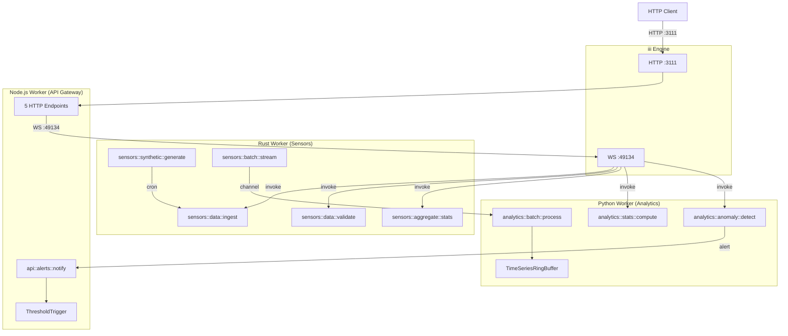

# IoT Pipeline Example

A cross-language IoT sensor pipeline demonstrating iii-sdk capabilities across **Rust**, **Python**, and **Node.js**. Rust handles sensor ingestion and validation, Python performs analytics and anomaly detection, and Node.js provides an HTTP API gateway. All three workers communicate cross-language through the iii engine using WebSocket connections.

## Architecture



## Prerequisites

- **Rust** (with `cargo`) -- [rustup.rs](https://rustup.rs/)
- **Python >= 3.10** (with `uv`) -- [astral.sh/uv](https://docs.astral.sh/uv/)
- **Node.js** (with `npm` and `npx`) -- [nodejs.org](https://nodejs.org/)
- **iii engine** -- installed globally or built from source

## Setup

### Rust Worker

```bash
cd examples/iot-pipeline/rust-worker
cargo build
```

### Python Worker

```bash
cd examples/iot-pipeline/python-worker
uv sync
```

### Node.js Worker

```bash
cd examples/iot-pipeline/node-worker
npm install
```

## Startup Sequence

> **Order matters.** Start each process in a separate terminal. Node.js discovers Rust and Python peer functions on startup, so they must be running first.

1. **Start the iii engine:**
   ```bash
   iii
   ```
   Or, from the iii-engine source directory:
   ```bash
   cargo run
   ```

2. **Start the Rust worker:**
   ```bash
   cd examples/iot-pipeline/rust-worker
   cargo run
   ```

3. **Start the Python worker:**
   ```bash
   cd examples/iot-pipeline/python-worker
   uv run python -m src.main
   ```

4. **Start the Node.js worker:**
   ```bash
   cd examples/iot-pipeline/node-worker
   npx tsx src/index.ts
   ```

## HTTP Endpoints

Base URL: `http://localhost:3111`

| Method | Path | Description |
|--------|------|-------------|
| POST | /sensors/ingest | Ingest a sensor reading (calls Rust worker) |
| GET | /sensors/:id | Read sensor by ID from stream |
| GET | /analytics/summary | Get statistics (calls Python worker) |
| GET | /system/workers | List connected workers |
| GET | /system/functions | List registered functions |

## curl Examples

```bash
# Ingest a sensor reading
curl -s -X POST http://localhost:3111/sensors/ingest \
  -H "Content-Type: application/json" \
  -d '{"sensor_id":"temp-001","value":23.5,"unit":"celsius","timestamp":"2026-01-01T00:00:00Z"}'

# Read a sensor by ID
curl -s http://localhost:3111/sensors/temp-001

# Get analytics summary
curl -s http://localhost:3111/analytics/summary

# Get analytics summary for a specific sensor
curl -s "http://localhost:3111/analytics/summary?sensor_id=temp-001"

# List connected workers
curl -s http://localhost:3111/system/workers

# List registered functions
curl -s http://localhost:3111/system/functions
```

## Environment Variables

| Variable | Default | Used By | Purpose |
|----------|---------|---------|---------|
| `REMOTE_III_URL` | `ws://127.0.0.1:49134` | Rust worker | Engine WebSocket URL |
| `III_BRIDGE_URL` | `ws://localhost:49134` | Python, Node.js | Engine WebSocket URL |
| `SENSOR_CRON_INTERVAL` | `*/5 * * * * *` | Rust worker | Synthetic data cron schedule |

## Smoke Test

A smoke test script validates every endpoint after starting all workers:

```bash
./examples/iot-pipeline/smoke.sh
```

## Project Structure

```
examples/iot-pipeline/
├── FUNCTION_IDS.md          # Function naming registry
├── README.md                # This file
├── smoke.sh                 # End-to-end smoke test
├── rust-worker/             # Sensor ingestion (Rust)
│   ├── Cargo.toml
│   └── src/
│       ├── main.rs
│       └── sensors/         # models, data, aggregate, synthetic, batch
├── python-worker/           # Analytics (Python)
│   ├── pyproject.toml
│   └── src/
│       ├── main.py
│       ├── analytics/       # anomaly, stats, batch
│       └── streams/         # TimeSeriesRingBuffer
└── node-worker/             # API Gateway (Node.js)
    ├── package.json
    └── src/
        ├── index.ts
        ├── iii.ts
        └── triggers/        # threshold.ts
```
