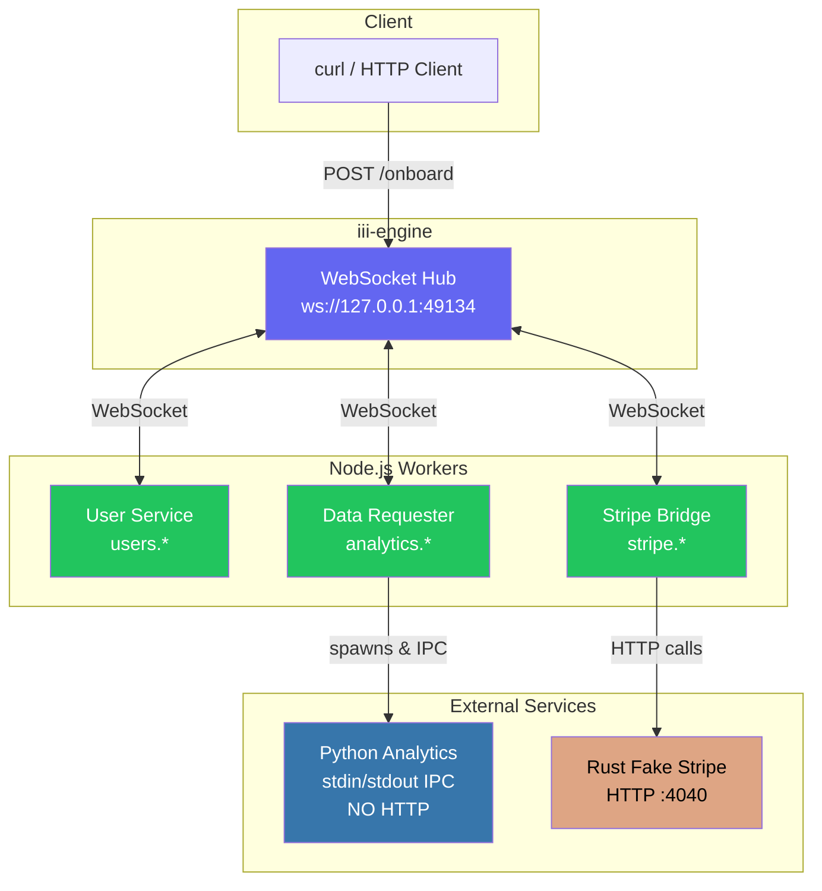

# Polyglot Coordination Example

This example demonstrates **iii-engine** seamlessly coordinating services across **Python, Node.js, and Rust** without requiring HTTP endpoints for all services.

**Key differentiator**: The Python service communicates via **stdin/stdout IPC** (not HTTP), showing that iii abstracts away transport mechanisms entirely.

## Architecture



## Business Scenario: SaaS User Onboarding

A realistic workflow tying all 3 languages together:

1. **New user signs up** → Node.js User Service
2. **Create Stripe customer + subscription** → Rust Fake Stripe (via HTTP, wrapped by iii)
3. **Run onboarding analytics** → Python Analytics (via stdin/stdout IPC)
4. **Store user profile with risk score** → Orchestrated by Node.js Workflow

## Prerequisites

- **Node.js 18+** or **Bun** (for workers)
- **Python 3.x** (stdlib only, no pip install needed)
- **Rust toolchain** (for Axum server)
- **iii-engine** running (`iii` command)

## Quick Start

### Terminal 1: Start iii-engine
```bash
iii
```

### Terminal 2: Start Rust Fake Stripe server
```bash
cd services/rust-stripe
cargo run --release
```

### Terminal 3: Install deps and start workers
```bash
pnpm install
pnpm dev
```

## Testing

### Full onboarding flow (coordinates all 3 languages)
```bash
curl -X POST http://localhost:3111/onboard \
  -H "Content-Type: application/json" \
  -d '{"email": "alice@example.com", "name": "Alice Smith", "plan": "pro"}'
```

Expected response:
```json
{
  "message": "User onboarded successfully",
  "traceId": "abc123...",
  "user": {
    "id": "usr_...",
    "email": "alice@example.com",
    "name": "Alice Smith",
    "plan": "pro",
    "stripeCustomerId": "cus_...",
    "subscriptionId": "sub_...",
    "riskScore": 45.5
  },
  "stripeCustomer": { "id": "cus_...", "email": "...", "name": "..." },
  "subscription": { "id": "sub_...", "status": "active", "plan": "pro" },
  "analytics": { "riskScore": 45.5, "factors": ["custom_domain", "full_name_provided"] }
}
```

### Get metrics (calls Python analytics)
```bash
curl http://localhost:3111/onboard/metrics
```

### Onboard multiple users and check metrics
```bash
curl -X POST http://localhost:3111/onboard \
  -d '{"email": "bob@gmail.com", "name": "Bob", "plan": "free"}' \
  -H "Content-Type: application/json"

curl -X POST http://localhost:3111/onboard \
  -d '{"email": "carol@stanford.edu", "name": "Carol Chen", "plan": "enterprise"}' \
  -H "Content-Type: application/json"

curl http://localhost:3111/onboard/metrics
```

## Key Insight

All function calls look identical regardless of transport:

```typescript
// Calls Rust via HTTP (wrapped by stripe-bridge)
await bridge.invokeFunction('stripe.createCustomer', { email, name })

// Calls Python via stdin/stdout IPC (wrapped by data-requester)
await bridge.invokeFunction('analytics.score', { userId, email, name })

// Calls local Node.js function
await bridge.invokeFunction('users.create', { email, name })
```

**The caller doesn't know or care about the underlying transport. That's the power of iii.**

## File Structure

```
polyglot-coordination/
├── README.md
├── package.json
├── tsconfig.json
├── services/
│   ├── python-analytics/
│   │   └── analytics.py           # stdin/stdout JSON-RPC (NO HTTP)
│   └── rust-stripe/
│       ├── Cargo.toml
│       └── src/main.rs            # Axum HTTP server
├── workers/
│   ├── user-service.ts            # User CRUD + billing
│   ├── data-requester.ts          # Spawns Python, exposes analytics.*
│   └── stripe-bridge.ts           # Wraps Rust HTTP as iii functions
├── workflow/
│   └── onboarding.ts              # Orchestrates full signup flow
└── lib/
    ├── bridge.ts                  # Shared bridge factory
    ├── python-ipc.ts              # Python subprocess manager
    └── types.ts                   # Shared TypeScript types
```

## How It Works

### Python Analytics (stdin/stdout)
The Python service has **no HTTP endpoints**. It reads JSON from stdin, processes it, and writes JSON to stdout:

```python
for line in sys.stdin:
    request = json.loads(line)
    result = handle_request(request['method'], request['params'])
    sys.stdout.write(json.dumps({'id': request['id'], 'result': result}) + '\n')
```

The `data-requester.ts` worker spawns this script and communicates via stdin/stdout, then exposes the functionality as iii functions.

### Rust Fake Stripe (HTTP)
A standard Axum HTTP server providing a Stripe-like API. The `stripe-bridge.ts` worker makes HTTP calls to it and exposes the endpoints as iii functions.

### Node.js User Service
Pure Node.js with in-memory storage, directly registered as iii functions.

## Why This Matters

Traditional microservice orchestration requires:
- Every service to expose HTTP/gRPC endpoints
- Service discovery (Consul, etcd, K8s DNS)
- Load balancers, ingress controllers
- API gateways for routing

With iii-engine:
- Services can use **any transport** (HTTP, IPC, stdin/stdout, sockets)
- iii handles routing via **function names**
- No service discovery needed - iii is the registry
- No API gateway - iii exposes triggers directly
